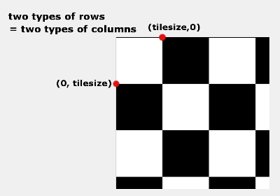

# Week 2: Paint a chess board

### [<- Back](/index.md) to project overview.

Our solution to the task of painting a chessboard on a 1000x1000 Window:

First the global variables WSIZE and OFFSET are set by a user-input in the console. WSIZE represents the size of the Window, OFFSET the width of the margin on the sides of the window. 
We then set the Window to the size WSIZExWSIZE at the position 310, 40 (this way a window of the original size 1000x1000 will be in the middle of a 1920x1080 screen).
The Chessbard itself is a scaled with the Window (the margin is substracted):
 - chessSize = WSIZE - 2 * OFFSET, 
 - tileSize = chessSize/8

A white background with a black border in the size of the chessBoard will serve as all the white tiles and yield a border around the whole board. The black tiles then get painted on with the pen disabled to prevent antoher border. That way, we have to change the pen options only once.

There are a number of different ways to paint the tiles. For example one can simply set up each of the 32 tiles seperatly.
Another possibility would be to create a nested for-loop (rows and collumns).

We ended up opting for a vectorial solution: If we observe the structure of a chess board closely, we can see that in some rows the first tile will be a black one, while in some rows the first tile should be white with the second one being black. Since the pattern of the board changes on line break, a solution with nested loops would have to deal with some exceptions. Instead we will make use of these special properties: 
As we found out above, each row starts either with a white tile or a black tile in an alternating pattern. Since the chess board is symmetrical, the same goes for the columns! Therefore, we need to distinguish only two different positionings for the x-coordinates of the topleft corner of the black tiles. And most importantly: These positions can serve as the y-coordinates for the black tiles, as well! 
Pythons list comprehensions allow us to easily create the two lists of coordinates needed, one for the rows/columns starting with a black tile and one for rows/columns starting with a white tile. As an advantage, the lists and coordinates inherently scale with the constants used for defining the board, so there would be no need to adapt them manually later. 
 
The coordinates of the topleft corners of all black tiles are now read from the lists as all combinations of possible tuples. But since the coordinates of the bootom left half correspond to the ones of the top right half with x and y swapped, we only need to create half of the tuple list and paint the corresponding coordinates in one iteration.

Of course, we needed to make sure to put a white tile in the top left corner of the board.
