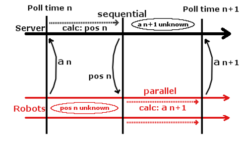

# Week 4: Implement Multithreading

### [<- Back](/index.md) to project overview.


## Task 1
### Convert discrete approach to continuos approach:
For the Multithreaded solution, a continuos approach seems more fitting. 
```python
class Board(QWidget):

    # every function using discrete parameters must be updated.
    # lucky for us, at first it's just the draw function!
    def drawRobot(self, qp, robot):

        # [...]

        # directly use the corrdinates of the robot without conversion 
        center = QPoint(robot.x, robot.y)
        
        # [...]

        # more changes are NOT NEEDED!

    # we keep all obstacle related functions in the discrete style
    # but loose the ability to detect collision for now.

    # the speed of the timer should be adapted as well
    # this should be roughly 30fps
    RefreshSpeed = 40
```
PyQt5 helps us out!<br/>
Instead of tile positions, we use pixel offset of the window with position (0 ,0) being the topleft corner. 

### The robot class needs more attributes, too:
```python
class BaseRobot():

     def __init__(self, radius, a_max, a_alpha_max):

        # set parameters
        self.radius = radius

        self.a_max = a_max
        self.a_alpha_max = a_alpha_max

        # current position
        self.x = 0
        self.y = 0
        self.alpha = 0

        self.v = 0
        self.v_alpha = 0

        # calculated by the robot
        self.a = 0
        self.a_alpha = 0
```
### The board knows about the robots position, since it is directly stored in the robot obejct.


### Our board should be able to support more than one robot:
```python
class Board(QWidget):
    def __init__(self, parent):
        super().__init__(parent)

        # we store a list of robots now!
        self.robots = []

        self.create_example_robots()

    def create_example_robots(self):
        # experiment with different max values and positions
        robo1 = BaseRobot(TILE_SIZE, 1000, 1000)
        Board.place_robot(robo1, 400, 400, 90)
        self.robots.append(robo1)

        robo2 = BaseRobot(TILE_SIZE * 5, 100, 0.2)
        Board.place_robot(robo2, 900, 800, 0)
        self.robots.append(robo2)

    def paintEvent(self, e):

        qp = QPainter()
        qp.begin(self)
        self.drawBoard(qp)
        self.drawObstacles(qp)

        # we need to draw every robot now
        for robot in self.robots:
            self.drawRobot(qp, robot)

        qp.end()
```


### We can't use our tile-based movement function anymore!
We need a new one!
```python
class Board(QWidget):
    def calculate_robot(self, robot, robot_data):
        # TODO re-place a robot on the board respective to
        # the next step,
        # the acceleration changes set by the robot
        # and it's current position and speed
        return new_position

    def timerEvent(self, event):

        for robot in self.robots:
            # TODO get data from robot
            new_position = self.calculate_robot(robot, robot_data)
            # TODO send new position to robot

        # update visuals
        self.update()
```


## Task 2
### Create different robots
Since we want different robots with different behaviour, but the same base structure, we need to ponder, how to implement the differences without changing too much of the base structure.

## Inheritance based approach vs functional approach
Instead of generating a class hierachy, we opt for a functional approach.
We make use of the fact, that in python even functions are normal objects:
```python
class Movement():

    @staticmethod
    def some_movement(sensor_data, **kwargs):
        # TODO calculate a and a_alpha from sensor data
        return new_a, new_a_alpha

    @staticmethod
    def different_movement(sensor_data, **kwargs):
        # TODO calculate a and a_alpha from sensor data
        return new_a, new_a_alpha


class BaseRobot():
    def __init__(self, radius, movement_funct, a_max, a_alpha_max):

        # set parameters
        self.radius = radius

        self.a_max = a_max
        self.a_alpha_max = a_alpha_max

        # Movement function to apply on sensor data.
        self.movement_funct = movement_funct

def create_example_robot():
    robo1 = BaseRobot(TILE_SIZE, Movement.some_movement, 1000, 1000)
    Board.place_robot(robo1, 400, 400, 90)
```
We only need to pass the desired movement function as parameter to the constructor. Therefore, we can treat the movement like any other set parameter.

## Task 3 
### Implement Multithreading
We now want to create multiple threads to parallel our game:

## Question: Parallelism
Before we can parallel the processes, we need to know, which processes of our program have to be sequential and which processes can be parallel.<br/>
<br/>
It seems like the calculations performed by the robots can be parallelized.

## Problem?
### Implement multiple Threads
Now we need to add multiple threads and thread management to our game.<br/>
This can be done in various ways:

## Approach 1: PyQt5
PyQt5 has some multithreading tools.
```python
from PyQt5.QtCore import QThreadPool, QRunnable, QObject, pyqtSignal, pyqtSlot

class BaseRobot(QRunnable):

    def __init__(self, params):
        super().__init__()

        self.signals = RobotSignals()

    @pyqtSlot()
    def run(self):
        # perform the calculations
        # where is the input?
        a, a_alpha = self.movement_funct(self)

        # here is no exception handling
        self.signals.finished.emit()

        # basic communication method
        return a, a_alpha
```
The robot becomes a `QRunnable`. We also use PyQt5s `Signals` for basic communication between threads. <br/>
Now we need to start and set up the robot!
```python
class Board(QWidget):

    def initRobots(self):

        # open a new threadpool for Qt to manage.
        self.threadpool = QThreadPool()
        print("Multithreading with maximum %d threads" %
              self.threadpool.maxThreadCount())

        robo1 = BaseRobot('params')
        
        # prevent deletion of the robot after performing one thread action.
        robo1.setAutoDelete(False)

        # connect events for communication
        robo1.signals.finished.connect(self.robot_finished)

        # add the robot to the board.
        self.robots.append(robo1)

    def timerEvent(self, event):

        for robot in self.robots:
            # phase 1: calc pos n
            self.calculate_robot(robot)

            # phase 2: calc a n+1 from pos n
            # use a new thread
            self.threadpool.start(robot)

        # update visuals
        self.update()
```
### In this we create an new thread per robot and per calculation iteration!


## Problem?
### Continuos Threads
Instead of generating a new Thread for every calculation, for future purposes it might be appropriate to create continuos threads, performing all the calculations for one robot each.<br/>
Also, a proper solution for server-robot-communication with PyQt5 might proove difficult.

## Approach 2: `threading` Library
We use the tools of the python `threading` library instead since they are easier to manage and might be more of use in different programming projects.
```python
import threading

class Board(QWidget):

    def __init__(self, parent):
        super().__init__(parent)
    
        self.robots = []
    
        robo1 = BaseRobot('params')
        self.robots.append(robo1)

        for robot in self.robots:
            # only call run method ONCE
            robot.run()


class BaseRobot():

    def __init__(params):
        # [...]
        self.thread = None
    
    def run(self):
        # here we create a new thread for the robot object.
        self.thread = threading.Thread(
            target=self._thread_action, args=("INPUT?",))
        self.thread.daemon = True
        # and GO!
        self.thread.start()

    def _thread_action(self, INPUT):
        # TODO somehow use movement function after getting input.
```
We use a deamon thread for each robot that will run in the background and perform all calculations of the respective robot.

## Problem?
### Communication with the Board
Normally, you would pass a function to another thread, let it asynchronously calculate the results and then read the results. No communication inbetween is needed, especially not from side thread to main thread. We have the problem, that after starting our thread, it will get input in regular intervalls and needs to give output in regular intervalls, too!
```python
    def _thread_action(self, INPUT):
        while True:
            if INPUT???:
                out = calculateOutput(INPUT???)

                #this will brak while loop
                return out
```

## Solution!
### Thread Output
As a simple solution, we decide, that the robot thread will set the attributes of the robot instance. The board can look these values up in set intervalls!
```python
class BaseRobot():

    def _thread_action(self, INPUT):
        while True:
            if INPUT???:
                self.a, self.a_alpha = self.movement_funct(INPUT???)

    def send_action_data(self):
        return self.a, self.a_alpha


class Board(QWidget):
    
    def timerEvent(self, event):

        for robot in self.robots:
            a_n = robot.send_action_data()
            pos_n = self.calculate_robot(a_n)
            # INPUT???
```
### What if the robot threads calculations are not finished when the board looks up the values?
### Then the robot is at fault! It's calculations are too slow and it's out of competition!


## Solution!
### Input Queue
For the input a new library will come in handy:
```python
import queue
import time

class BaseRobot():

    def __init__(params):
        # new attribute sensor_queue
        self._sensor_queue = queue.Queue()

    def run(self):
        self.thread = threading.Thread(
            target=self._thread_action, args=(self._sensor_queue,))
        self.thread.daemon = True
        self.thread.start()

    def receive_sensor_data(self, data):
        self._sensor_queue.put(data)

    
    def _thread_action(self, q):

        while True:
            # get() blocks the thread until queue is not empty anymore
            signal = q.get()
            if not signal:
                time.sleep(0)
                continue

        self.a, self.a_alpha = self.movement_funct(signal)

    
class Board(QWidget):

    def timerEvent(self, event):

        for robot in self.robots:
            # get the values from the robots
            poll = robot.send_action_data()
            # calculate their new positions
            new_data = self.calculate_robot(poll)
            # send the data to the robots
            robot.receive_sensor_data(new_data)
```

## Advantage: Extensibility
### This form of input is easily extendible. For example we could define different input types to be enqueued: To alert the robot when collision is happening or to trigger different behaviour (attack!).


## Task 4
### Make the Robots move!

## Implement the `calculate_robot` function.
```python
        # checks if acceleration is valid
        a = poll[0]
        if a > robot.a_max:
            a = robot.a_max
        # checks if angle acceleration is valid
        a_alpha = poll[1]
        if a_alpha > robot.a_alpha_max:
            a_alpha = robot.a_alpha_max

        # calculates new values
        new_v = robot.v + a
        new_v_alpha = robot.v_alpha + a_alpha
        new_alpha = robot.alpha + new_v_alpha
        radian_alpha = ((new_alpha - 90) / 180 * math.pi)

        # calculates x coordinate, only allows values inside walls
        new_x = (robot.x + new_v * math.cos(radian_alpha))

        # calculates y coordinate, only allows values inside walls
        new_y = (robot.y + new_v * math.sin(radian_alpha))
```
With the "a" and "a_alpha" values received from each poll we can calculate the information needed to place the robot correctly, set its velocity, angle velocity and send the robot data about its self.
```python
        # sets new values for the robot
        robot.v = new_v
        robot.v_alpha = new_v_alpha
        # places the robot on the board
        Board.place_robot(robot, new_x, new_y, new_alpha)
        # sends tuple to be used as "sensor_date"
        return new_x, new_y, new_alpha, new_v, new_v_alpha
```
## Let's implement some movement functions!
```python
class Movement:

    @staticmethod
    def random_movement(sensor_data, **kwargs):
        if sensor_data[3] < 15:
            a = 1
            a_alpha = random.randint(-20, 20)
        else:
            a = 0
            a_alpha = random.randint(-20, 20)
        return a, a_alpha

    @staticmethod
    def nussschnecke_movement(sensor_data, **kwargs):
        if sensor_data[3] < 7:
            a = 0.5
            a_alpha = 1
            return a, a_alpha
        else:
            a = 0
            a_alpha = 0
        return a, a_alpha

    def spiral_movement(sensor_data, **kwargs):
        if sensor_data[3] < 20:
            a = 1
            a_alpha = 1
            return a, a_alpha
        else:
            a = 1
            a_alpha = 0
        return a, a_alpha


    @staticmethod
    def spin_movement(sensor_data, **kwargs):
        a = 0
        a_alpha = 99999999
        if sensor_data[4] > 30:
            a = 0
            a_alpha = 0
        return a, a_alpha

    @staticmethod
    def unchanged_movement(sensor_data, **kwargs):
        a = 0
        a_alpha = 0
        return a, a_alpha
```
The movement function of a robot determines if or how much the robot accelerates and how much the its alpha should change.
These values get set based on the data that the robot receives and are used as poll data when calculating the resulting changes.
## Additional Features:
# MAYBE TODO (Leander)

# Help! The robots are becoming independent!
