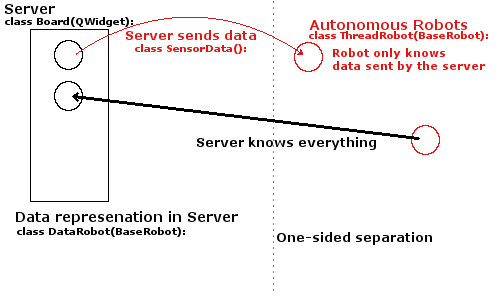

# Week 5: Improve Robot Functionalities

### [<- Back](/index.md) to project overview.

### To add more functionalities to the robot, we need to improve the structure of our project!

# Refactor Code
### General idea: The Server needs to store a data implementation of each robot, where it stores its current position values. Each robot will act as a separate entity and will perform its calculations in its own thread.



### The server knows everything about every robot. But each robot can only access data chosen by the server.

## Measurement: Separate data representation from thread functionality
```python
# BaseRobot class to provide static parameters of a robot.
class BaseRobot():

    def __init__(self, radius, a_max, a_alpha_max):
        # set parameters
        self.radius = radius

        self.a_max = a_max
        self.a_alpha_max = a_alpha_max


# Data representation to be stored by the board.
class DataRobot(BaseRobot):

    def __init__(self, base_robot: BaseRobot):

        super().__init__(**vars(base_robot))

        # current position
        self.x = 0
        self.y = 0
        self.alpha = 0

        self.v = 0
        self.v_alpha = 0

    def place_robot(self, x, y, alpha, v, v_alpha):

        self.x = x
        self.y = y
        self.alpha = alpha

        self.v = v
        self.v_alpha = v_alpha


# Representation of the autonomous robot.
class ThreadRobot(BaseRobot):

    def __init__(self, base_robot: BaseRobot, movement_funct):

        super().__init__(**vars(base_robot))

        # calculated by the robot, read by the board
        self.a = 0
        self.a_alpha = 0

        self.thread = None
        self._sensor_queue = queue.Queue()

        # the behaviour of the robot
        self.movement_funct = movement_funct

    def run(self):

        self.thread = threading.Thread(
            target=self._thread_action, args=(self._sensor_queue,))
        self.thread.daemon = True
        self.thread.start()

    def _thread_action(self, q):

        while True:
            # Sensor Queue gets read [...]
            self.a, self.a_alpha = self.movement_funct(queue_data)
```
### Now the robot won't be able to cheat its own position anymore since he has no access to it!

## Problem: Communicate with the Server
### How does the server know about the robots changes? How does the robot get input for its sensor queue?
```python
class ThreadRobot(BaseRobot):

    # where do i call these functions?    
    def send_action_data(self):
        return self.a, self.a_alpha

    # what is the data?
    def receive_sensor_data(self, data):
        self._sensor_queue.put(data)
```

## Solution Part 1: Data storage of the Server
The server needs to know everything about the robot. Why don't we store the autonomous unit as attribute of the `DataRobot()` class?
```python
class DataRobot(BaseRobot):

    def __init__(self, base_robot: BaseRobot, thread_robot: ThreadRobot):

        super().__init__(**vars(base_robot))

        # position values [...]
        self.thread_robot = thread_robot
```

Our construction method needs to be a bit more complicated now:
```python
class Board(QWidget):
    def __init__(self, parent):

        # Now we store only DataRobots here
        self.robots = []

    def construct_robot(self, radius, movement_funct,
                        a_max, a_alpha_max, position):

        # first create BaseRobot with set values
        base_robo = BaseRobot(radius, a_max, a_alpha_max)

        # then create ThreadRobot from BaseRobot and give it a 'brain'.
        thread_robo = ThreadRobot(base_robo, movement_funct)

        # finally create data representation with pointer
        # to the autonomous robot unit.
        data_robot = DataRobot(base_robo, thread_robo)

        # a position consists of (x, y, alpha, v, v_alpha) values
        data_robot.place_robot(*position)

        # The server will store the new DataRobot
        self.robots.append(data_robot)
```
Now our data model is set. We can proceed to the actual communication:

## Solution Part 2: Create an Interface
Part of our separation between server and robot is that both should be seen as closed systems. Therefore, we want to replace direct modifications with communication over interface mathods that might or might not have additional functionality:
```python
class ThreadRobot(BaseRobot):

    # Robot-intern functionality
    def send_action_data(self):
        return self.a, self.a_alpha

    def receive_sensor_data(self, data):
        self._sensor_queue.put(data)
    
    def run(self):
        # [...] start the Thread


class DataRobot(BaseRobot):

    # Interface functions
    def poll_action_data(self):
        return self.thread_robot.send_action_data()

    def send_sensor_data(self, data):
        self.thread_robot.receive_sensor_data(data)

    def start(self):
        self.thread_robot.run()


class Board(QWidget):

    def timerEvent(self, event):

        for robot in self.robots:
            # use the interface functions of the data represenation
            poll = robot.poll_action_data()

            new_data = calculate_robot_data(self, poll, robot)

            robot.send_sensor_data(new_data)
```
Now our server and our robot truly are separate entities.

## Measurement: Modularisation
### We are accumulating a lot of code by now!<br/> But since we achived better modularity, we can now separate our project into three different files!

### We distinguish functionalities of the Server, the Robot and the actual implementation of the robot's movements:
```python
# Server.py
# Here go the data structure, the window and paint functionality
# and the control functionalities for the game,
# like physics calculations (coordinates) and tick-rate.
# This is the main file!

from Movement import # the movement functions you need
from Robot import BaseRobot, ThreadRobot

class Game(QMainWindow):
    # [...]

class Board(QWidget):

    def paintEvent(self, e):
        # [...]

    def calculate_robot_data(self, poll, robot):
        # [...]

    def timerEvent(self, event):
        # [...]

class DataRobot(BaseRobot):
    # [...]

if __name__ == '__main__':
    # [...]
```
### Mind the import statements!
```python
# Robot.py
# Here goes the functionality of the robot.
# For now, its just the ability to perform a movement function in its own thread.
# But that will change soon!

# No import statements needed! No PyQt5-functionality needed!

class BaseRobot():
    # [...]

class ThreadRobot(BaseRobot):

    def run(self):
        # [...]

    def thread_action(self, q):
        # [...]
            self.movement_funct(data)
        # [...]
```
```python
# Movement.py
# Here we implement all movement functions
# that will act as a brain of the robot.
# Since these are concrete implementations, they don't go into Robot.py

# No import statements needed!

class Movement():
    # concrete implementations!
```

## Solution Part 3: Message Data
### Our server is now able to contact each robot by sending message data. But how should this message data look like?
```python
class SensorData():

    def __init__(self, data):

        self.data = data
```
This doesn't look impressive, so far.

## Task: Distinguish different message types
### The Server will not only send position data for a robot itself, but will also alert the robot of the presence of other robots!
We improve the `SensorData()` class:
```python
class SensorData():

    # We want to be able to support different message types consitantly!
    POSITION_STRING = 'position' # the robots current position and speed
    ALERT_STRING = 'alert' # the coordinates of all other robots
    BONK_STRING = 'bonk' # mysterious as well as unused
    IGNORE_STRING = 'ignore' # ¯\_(ツ)_/¯

    def __init__(self, message_type: str, data):

        self.message_type = message_type
        self.data = data
        # there is room for even more information!
```

### Since the robot should be able to react to the different message types appropriately, we need to improve it as well.
### We dicide, that this ability doesn't belong into the robots concrete implementation (the movement functions) and should be handled by the robots structure instead.

## Problem: What function should be used!
### Different robots might have different behaviour when confronted with a message of a certain type.
```python
# Robot.py
class ThreadRobot(BaseRobot):

    def thread_action(self, q):

        while True:

            # get signal from Queue

            funct = self.decode_input(signal)
            self.a, self.a_alpha = funct(signal.data, self)
```

## Solution: Refactor `Movement()` class
### We split the different behaviours into different classes, all with their own set of functions.
```python
class Movement():
    """The base movement class"""
    # provides default reactions to all different message types

    # the most common message, the robot should adapt its acceleration 
    # with knowledge of its own position:
    # data = position tuple
    def position(self, data, robot):
        return 0, 0

    # the server informs every robot on the positions of all robots
    # data = list of coordinate tuples
    def alert(self, data, robot):
        # keep movement unchanged
        return robot.a, robot.a_alpha

    # mysterious and unused
    def bonk(self, data, robot):
        return robot.a, robot.a_alpha

    # might be useful for extensibility
    def default(self, data, robot):
        return robot.a, robot.a_alpha


# a non-default implementation of a movement function
class SpiralMovement(Movement):

    # we only need to override the reaction to a position message
    def position(self, data, robot):

        x, y, alpha, v, v_alpha = data

        if v < 20:
            a = 1
            a_alpha = 1
            return a, a_alpha
        else:
            a = 1
            a_alpha = 0
            return a, a_alpha
```
### Now the robot needs a way to call the right function!
A robot's movement_function is an instance of the desired movement function class:
```python
class ThreadRobot(BaseRobot):

    # self.movement_function = DesiredMovement()

    def thread_action(self, q):

        while True:
            # q.get() signal from Queue

            funct = self.decode_input(signal)
            self.a, self.a_alpha = funct(signal.data, self)

    # not that pretty at the momvent,
    # but there might be additional functionality needed later.
    def decode_input(self, signal):

        if signal.message_type == SensorData.POSITION_STRING:
            funct = self.movement_funct.position

        elif signal.message_type == SensorData.ALERT_STRING:
            funct = self.movement_funct.alert

        elif signal.message_type == SensorData.BONK_STRING:
            funct = self.movement_funct.bonk

        else:
            funct = self.movement_funct.default

        # we set the used reation function according
        # to the type of the processed message.
        return funct
```

### The server should control and send these messages in regular intervalls:
```python
class Board(QWidget):

    def create_alert_message(self):
        data = []

        for robot in self.robots:
            data.append((robot.x, robot.y))

        # set the message_type and data
        # data is a list of all robot's coordinates
        return SensorData(SensorData.ALERT_STRING, data)

    def create_position_message(self, robot):

        # data is the current position and speed of the robot
        data = (robot.x, robot.y, robot.alpha, robot.v, robot.v_alpha)
        return SensorData(SensorData.POSITION_STRING, data)

    def timerEvent(self, event):

        for robot in self.robots:
            poll = robot.poll_action_data()
            # this will set the values in the DataRobot
            self.calculate_robot(poll, robot)

        # this is done every tick for now.
        # but it will be done every 10th tick soon.
        # for the implementation look at -> Task: Resync
        m = self.create_alert_message()
        for robot in self.robots:
            robot.send_sensor_data(m)

        for robot in self.robots:
            m = self.create_position_message(robot)
            robot.send_sensor_data(m)
```
### Now let's see what we can do with this!


# Movement Functions
## Problem: Finite State Machine
### A movement function in its current state doesn't provide a memory!
```python
        self.destination = None
```
## Solution: Additional Functionality for the Robot
### We add a new attribute to the robot: A destination tuple.


## Problem: Follow a specific Robot
### How do we know, which robot will be our target?
```python
class FollowMovement(Movement):

    def __init__(self, target):
        self.target = target

    # simple variant without extrapolation

    def alert(self, data, robot):
        # setting robot destination to the coordinates of target robot
        robot.destination = data[self.target]
        return robot.a, robot.a_alpha

    def position(self, data, robot):
        x, y, alpha, v, v_alpha = data

        # setting the robots destination
        if not robot.destination:
            destination_x = x
            destination_y = y
        else:
            destination_x = robot.destination[0]
            destination_y = robot.destination[1]
```
## Solution: Additional Functionality for the Movement Behaviour
### 
Every 10 ticks the robot receives  the alert signal which contains the coordinate tupels of each robot in a list. This way the input number can be used as index of the list to get the position of the targeted robot.

## Problem: Moving towards destination 
### What is the angle between the direction on the robot and its target?
```python
    def position(self, data, robot):
        x, y, alpha, v, v_alpha = data

        # setting the robots destination
        if not robot.destination:
            destination_x = x
            destination_y = y
        else:
            destination_x = robot.destination[0]
            destination_y = robot.destination[1]
            
        # calculating angle between the velocity vector and the destination vector
        alpha = alpha % 360
        radian = (alpha / 180 * math.pi)

        # calculating movement vector
        velocity_vector_x = (v * math.sin(radian))
        velocity_vector_y = - (v * math.cos(radian))
        velocity_vector_magnitude = math.sqrt(velocity_vector_x**2 + velocity_vector_y**2)

        # calculating vector between robot and destination
        destination_vector_x = destination_x - x
        destination_vector_y = destination_y - y
        destination_vector_magnitude = math.sqrt(destination_vector_x**2 + destination_vector_y**2)

        # calculating the value of the angle_change needed
        vector_multiplication = (velocity_vector_x*destination_vector_x + velocity_vector_y*destination_vector_y)
        magnitude_multiplication = velocity_vector_magnitude * destination_vector_magnitude
        destination_alpha = math.acos(vector_multiplication / magnitude_multiplication)
        destination_alpha_degree = (destination_alpha * 180 / math.pi) % 360
```
## Solution: Vector calculations
### 
First we calculate the values of the velocity vector and the vector between the robots coordinates and its destination.
With these vectors we can now do the maths needed to calculate the smaller angle towards the target.

### In which direction is the destination?
```python
        ...
        # determining direction based on sign of the vectors cross product
        cross_product = FollowMovement.cross_product((velocity_vector_x,velocity_vector_y),(destination_vector_x,destination_vector_y))
        
        if cross_product > 0:
            delta_alpha = destination_alpha_degree
            direction = "right"
        elif cross_product < 0:
            delta_alpha = - destination_alpha_degree
            direction = "left"
        elif cross_product == 0:
            delta_alpha = destination_alpha_degree
            direction = "none"
            
 @staticmethod
    def cross_product(B, P):
        # calculates cross product
        b_x = B[0]
        b_y = B[1]
        p_x = P[0]
        p_y = P[1]

        cp = b_x * p_y - b_y * p_x
        return cp
```
## Solution: The cross product
### 
When inputting the earlyer calculated vectors we can tell the direction by looking at the sign of the cross product.
With this information we set the direction and give the wanted angle change (delta_alpha) a sign.

### How should the robot behave?
```python
        # setting a to accelerate to a speed of 10
        if v <= 10:
            a = 1
        else:
            a = 0
            
        # setting a_alpha values
        a_alpha_max = robot.a_alpha_max
        
        if direction == "right":
            if delta_alpha >= a_alpha_max + v_alpha:
                a_alpha = a_alpha_max
            elif delta_alpha < a_alpha_max + v_alpha:
                a_alpha = delta_alpha - v_alpha

        elif direction == "left":
            if abs(delta_alpha) >= abs(a_alpha_max - v_alpha):
                a_alpha = - a_alpha_max
            elif abs(delta_alpha) < abs(a_alpha_max - v_alpha):
                a_alpha = -(abs(delta_alpha)) + abs(v_alpha)

        if direction == "none":
            a_alpha = 0

        return a, a_alpha
``` 
The robot increases its speed by one each timestep until it reaches a speed of 15.
If the angle can't be changed sufficiently within one tick the angle acceleration is set to its maximum value.
If the angle can be changed sufficiently we set it to the change of alpha we want minus the current velocity to get the correct value for a_alpha.


# Improve Collision Management
```python
new_position = (new_x, new_y, new_alpha, new_v, new_v_alpha)
```
## Test for collision on a specific tile
### Old - returns bool
```python
    def check_collision(self, robot, robot_x, robot_y, tile_x, tile_y):
        # calc the coordinates of the given tile
        tile_left = tile_x * TILE_SIZE
        tile_upper = tile_y * TILE_SIZE

        # calc the closest point in the rectangle to the robot
        closest_point_x = self.limit(robot_x, tile_left, tile_left + TILE_SIZE)
        closest_point_y = self.limit(robot_y, tile_upper, tile_upper + TILE_SIZE)

        # calc the x and y distance from the closest point to the center of the robot
        dx = abs(closest_point_x - robot_x)
        dy = abs(closest_point_y - robot_y)
        # calc the actual distance
        distance = math.sqrt(dx**2 + dy**2)

        # return if collision
        return distance < robot.radius
```
### New - returns closest position without collision and amount of backtracing
```python
    # checks if the robot collides with a specific tile
    def collision_single_tile(self, new_position, robot, tile_x, tile_y):
        # calc the coordinates of the given tile
        tile_left = tile_x * TILE_SIZE
        tile_upper = tile_y * TILE_SIZE

        # loop terminates when there is no collision
        sub_from_v = 0
        while True:
            # recalc the position with the adjusted v
            new_position_col = self.calculate_position(robot, new_position[3] - sub_from_v, 
                                                       new_position[4])
            # calc the closest point in the rectangle to the robot
            closest_point = QPoint(self.limit(new_position_col[0], tile_left, tile_left + TILE_SIZE),
                                   self.limit(new_position_col[1], tile_upper, tile_upper + TILE_SIZE))
            # calc the x and y distance from the closest point to the center of the robot
            dx = abs(closest_point.x() - new_position_col[0])
            dy = abs(closest_point.y() - new_position_col[1])

            # calc the actual distance
            distance = math.sqrt(dx ** 2 + dy ** 2)

            # distance >= robot.radius means no collision
            # sub_from_v >= new_position[4] means v <= 0
            if distance >= robot.radius or sub_from_v >= new_position[4]:
                break

            # if there is a collision reduce v by one and try again (backtracing)
            else:
                sub_from_v += 1

        # return the amount of backtracing (0 if no collision) and the closest position that is collision free
        return sub_from_v, new_position_col
```
## Test for every tile and take the biggest step back
### Repeat until there is no collision
```python
    def calculate_collision(self, robot, new_v, new_v_alpha):

        # calculates the new position without factoring in any collisions
        position_no_col = self.calculate_position(robot, new_v, new_v_alpha)
        current_testing_position = position_no_col

        # loop continues until the current position doesn't produce any collision
        collided = False
        while True:
            max_sub = 0

            # tests all 100x100 tiles in the array for collision
            for tile_x in range(Board.TileCount):
                for tile_y in range(Board.TileCount):
                    if self.obstacleArray[tile_x][tile_y] != 0:

                        # takes the position where it doesn't collide and the amount it backtraced
                        sub_from_v, current_position_col = self.collision_single_tile(current_testing_position,
                                                                                      robot, tile_x, tile_y)
                        # saves position with the most backtracing (the tile where it was in deepest)
                        if sub_from_v > max_sub:
                            max_sub = sub_from_v
                            final_position_col = current_position_col

            # if this iteration (one position) produced any collisions the final position gets tested again
            if max_sub:
                current_testing_position = final_position_col
                # test if this adjusted position needs more adjusting
                collided = True
            # if the position didn't produce any collisions the robot doesn't collide with anything
            else:
                break

        # if any iteration produced any collisions : v = 0
        if collided:
            final_position_col = (final_position_col[0], final_position_col[1],
                                  final_position_col[2], 0, final_position_col[4])
        # if there was na collision at all, the original position is returned
        else:
            final_position_col = position_no_col
        return final_position_col
```

# Additional Features

## Task: Resync
### If our robot is too slow with its calculations, a huge load of incoming messages will stockpile in its `sensor_queue`.
That is bascily the robots fault, be we want to give him another tool to cope with this.

### The server needs a timestamp, that we can associate messages with a certain server tick.
```python
class Board(QWidget):
    def __init__(self, parent):

        self.time_stamp = -1
        self.timer.start(Board.RefreshSpeed, self)

    def timerEvent(self, event):

        # count the number of ticks!
        self.time_stamp += 1

        for robot in self.robots:
            poll = robot.poll_action_data()
            self.calculate_robot(poll, robot)

        # now we can initiate a message only every n ticks.
        if self.time_stamp % 10 == 0:

            m = self.create_alert_message()
            for robot in self.robots:
                robot.send_sensor_data(m)

        for robot in self.robots:
            m = self.create_position_message(robot)
            robot.send_sensor_data(m)
```
### The messages should know the tick at which they where sent:
```python
class SensorData():

    def __init__(self, message_type: str, data, time_stamp):

        self.message_type = message_type
        self.data = data
        self.time_stamp = time_stamp

class Board(QWidget):

    # all message creations should put the current timestamp in the message
    def create_???_message(self, robot):
        # data = ???
        return SensorData(SensorData.???_STRING, data, self.time_stamp)
```

## Problem: There are many re-synchronisation strategies!
### We can distinguish synchronous (called by the robot) and asynchronous (called by the server) strategies, each with their own problems and benefits.
For example every n ticks the server could send a special resync-message, that requests the robots to initiate resync. But this message would be stuck in the queue as well... <br/>
Or the Server could perform a resync by itself, stopping the threads of every robot and emptying its queue. But this "stop-the-world"-method would be really bad design, not even considering breaking the separation and modularisation. <br/>
Or the robot could engage a resync from time to time. But how does the robot know, WHEN the right time is and even what the current `time_stamp` of the server is!

### There is also the question how to deal with the stuck messages!

## Solution: Auto-Resync
### We implement a static resync-behaviour, that can be turned on or off into the robot.
### This strategy will not be up-to-date all the time, but it will prevent the robot from indefinitely stacking `sensor_queue` input.
We need a way for the robot to approximately know the current `time_stamp` of the server. We add two new attibutes to the robot:
```python
class ThreadRobot(BaseRobot):
    def __init__(self, base_robot: BaseRobot, movement_funct,
                 resync_flag=False):

        # The resync_flag specifies, wheather the robot uses auto-resync.
        # default value: False
        self.resync_flag = resync_flag
        # The robot will have a way to approximate the servers time_stamp.
        self.resync_data = 0

    # the magic happens HERE:
    def receive_sensor_data(self, data):
        # before processing the message, we update
        # the robot's knowledge of the current time_stamp
        # using the value form the latest received message.
        if self.resync_flag:
            self.resync_data = data.time_stamp

        self._sensor_queue.put(data)
```
### We will now add a static resync-policy to the robot.
This might be customizable later - following the suit of the movement functions.
```python
class ThreadRobot(BaseRobot):

    # will return True is resync is nessesary
    def resync_check(self, signal):
        # this will be called from inside of the thread
        # if difference between the timestamp of the currently processed message
        # and the approximated timestamp of the server is larger
        # than a threshold, resync is needed.
        dif = self.resync_data - signal.time_stamp

        # check if a message has priority.
        # If the next message has priority, it will be processed normally.
        # No resync will be triggered for this message.
        prio = signal.message_type in [SensorData.ALERT_STRING,
                                       SensorData.BONK_STRING]
        return dif >= 2 and (not prio)
```
### Now we need to implement the actual resync:
```python
class ThreadRobot(BaseRobot):

    def _thread_action(self, q):

        while True:
            # q.get() the next signal from the queue

            # auto-resync:
            # note, that resync_check is only perfomed, if the resync_flag is set!
            if self.resync_flag and self.resync_check(signal):
                # simply drop the current signal before processing
                continue

            funct = self.decode_input(signal)
            self.a, self.a_alpha = funct(signal.data, self)
```
In future implementations a more elaborate strategy might see use, but this will do the trick for now.

## Functionality: Basic Memory
### A robot might need to remember past messages.
Maybe to predict other robot's movements.
```python
from collections import deque

class ThreadRobot(BaseRobot):

    # all robots will be able to remember up to 10 messages
    MemSize = 10

    def __init__(self, base_robot: BaseRobot, movement_funct,
                 resync_flag=False):

        # simple memory stack for the robot.
        self.memory = deque([])

    # use this to save a signal
    def memorize(self, signal):
        self.memory.appendleft(signal)
        # if the memories max size is reached, we drop the oldest entry.
        if len(self.memory) > ThreadRobot.MemSize:
            self.memory.pop()
```
### The robot now needs to adapt a memory policy.
We choose to implement a static example policy. Like resyc-policies, this might be outsourced following the suit of the movement function.
```python
def _thread_action(self, q):

        while True:
            # q.get() the next signal from the queue

            # auto-resync
            # [...]

            funct = self.decode_input(signal)
            self.a, self.a_alpha = funct(signal.data, self)

            # right now, every ALERT-message gets memorized.
            if signal.message_type == SensorData.ALERT_STRING:
                self.memorize(signal)
```
There is a lot of consideration needed before adapting other policies, since the resync-operation and the memorisation should work well together!

## Teaser: BONK-Messages
### When the robot hits an obstacle, it will stop in its calculated path.
This might prove troublesome, since in the worst case, the robot will collide with the same obstacle again and again and again and again...
### We choose to implement a special message to inform the robot, that he hit an obstacle!
```python
class SensorData():
    BONK_STRING = 'bonk'

class Board(QWidget):

        def create_bonk_message(self, collision):

            # This is only the template of a functionality that might be used later.
            data = self.bonkfy(collision)
            return SensorData(SensorData.BONK_STRING, data, self.time_stamp)
```
### A bonk-message is sent to a robot, whenever it collides with something.
```python
def timerEvent(self, event):

        for robot in self.robots:
            poll = robot.poll_action_data()
            # the calculate_robot method will return wheather a robot has BONKed
            # as well as some data about the obstacle and position.
            # It returns false if no collision is detected.
            collision = self.calculate_robot(poll, robot)
            if collision:
                # Send them BONK-messages, baby!
                m = self.create_bonk_message(collision)
                robot.send_sensor_data(m)

        # [...]

        for robot in self.robots:
            m = self.create_position_message(robot)
            robot.send_sensor_data(m)
```
### Now the robot can deal with it in its own way by implementing a reation to a BONK-message in its movement function.
```python
class ThreadRobot(BaseRobot):

    def decode_input(self, signal):

        if signal.message_type == SensorData.BONK_STRING:
            funct = self.movement_funct.bonk

        # [...]

        return funct


class Movement():

    def bonk(self, data, robot):
        return robot.a, robot.a_alpha
```

## This robot just got a new follower!