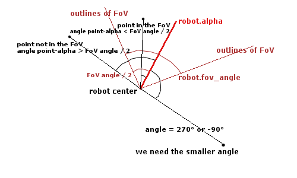
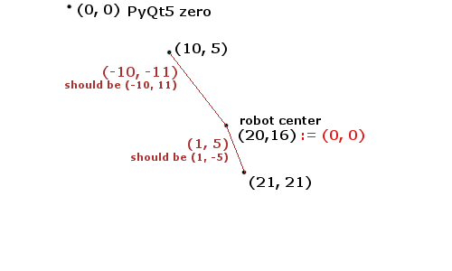
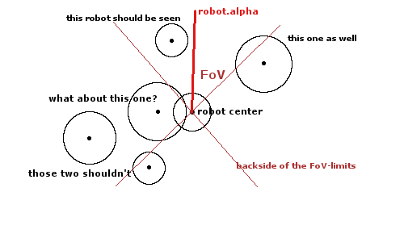

# Week 6: Give the Robots a Field of View

### [<- Back](/index.md) to project overview.

# Task: The Field of View
### Since the robots aren't omnipotent anymore, they should not be omniscient, too. <br/> We restrict the information, a robot gains from the server to a field of view.
```python
class BaseRobot:

    def __init__(self, radius, a_max, a_alpha_max, fov_angle=90):
        # set parameters
        self.radius = radius

        self.a_max = a_max
        self.a_alpha_max = a_alpha_max

        self.fov_angle = fov_angle
```
### Also, we should be able to adjust, which robot should receive alert-messages:
```python
class DataRobot(BaseRobot):

    def __init__(self, base_robot: BaseRobot, thread_robot: ThreadRobot):

        # Only some robots should receive an alert message.
        self.alert_flag = False

        # [...]

    def set_alert_flag(self, value=True):
        self.alert_flag = value


class Board(QWidget):

    def timerEvent(self, event):

        self.time_stamp += 1

        if self.time_stamp % 10 == 0:
            m = self.create_alert_message()
            for robot in self.robots:
                # send only to robots with set alert flag
                if robot.alert_flag:
                    robot.send_sensor_data(m)

        # [...]
```
Of course, we also need to adapt our robot creation function a bit:
```python
    def construct_robot(self, radius, movement_funct, a_max, a_alpha_max,
                        position, fov_angle=90, alert_flag=False):

        # We also need to set the fov_angle now.
        base_robot = BaseRobot(radius, a_max, a_alpha_max, fov_angle)
        thread_robo = ThreadRobot(base_robot, movement_funct)
        data_robot = DataRobot(base_robot, thread_robo)
        # do the alert flag-thing
        if alert_flag:
            data_robot.set_alert_flag()

        # a position consists of (x, y, alpha, v, v_alpha) values
        data_robot.place_robot(*position)

        self.robots.append(data_robot)
```

## Task: The robot should receive field of view data
### We need to implement a new message type:
```python
class SensorData:

    POSITION_STRING = 'position'
    # The new vision message
    VISION_STRING = 'vision'

    # [...]


class ThreadRobot(BaseRobot):

    # The new process_data function
    def process_data(self, signal):

        dicc = {SensorData.POSITION_STRING: self.movement_funct.position,
                SensorData.VISION_STRING: self.movement_funct.vision,
                SensorData.ALERT_STRING: self.movement_funct.alert}

        t = signal.message_type
        funct = self.movement_funct.default

        if t in dicc:
            funct = dicc[t]

        self.a, self.a_alpha = funct(signal.data, self)


class Movement:

    def default(self, data, robot):
        return robot.a, robot.a_alpha

    def position(self, data, robot):
        return 0, 0

    # Each Movement now needs a vision response.
    def vision(self, data, robot):
        return robot.a, robot.a_alpha

    # [...]
```
Of course, the Server needs the ability to create vision messages as well:
```python
class Board(QWidget):

    def create_vision_message(self, robot):
        "New message type for FoV-data of a robot."

        data = ???
        return SensorData(SensorData.VISION_STRING, data, self.time_stamp)

    def timerEvent(self, event):

        # [...]

        # Now also send vision messages each tick.
        for robot in self.robots:
            v = self.create_vision_message(robot)
            robot.send_sensor_data(v)
            m = self.create_position_message(robot)
            robot.send_sensor_data(m)
```

### But how does the data look like?

## Problem: Vision Data
### What does it mean for a robot and for an obstacle to be seen in the field of view?
This is NOT an easy question, since we are talking about two-dimensional shapes in uncountable infinit space of real numbers.<br/>
How does the field of view propagate?<br/>
What is a line of sight?<br/>
When can an object or robot be seen?<br/>
Which coordinates of an object should we use?<br/>
How can we compare objects at all?<br/>
What are the concrete implementations of our FoV-checks?<br/>
How should the output data look like?

### The list goes on.
## There is especially one point left to mention: Performance
### Checking m edged of n obejcts for s robots can result in a huge calculation time.<br/>But these calculations should be perofrmed EACH TICK, therefore, they must be done very fast.

### Therefore, we have to cut the cut the bill a bit.
We separate object data and robot data, since we need different precisions.
```python
def create_vision_message(self, robot):

    # list of wall object tuples:
    # ((xpos, ypos), type, distance)
    board_data = self.calculate_vision_board(robot)

    # list of robot object tuples:
    # ((xpos, ypos), distance)
    robot_data = self.calculate_vision_robots(robot)

    data = (board_data, robot_data)
    return SensorData(SensorData.VISION_STRING, data, self.time_stamp)
```
We return two lists: One for the objects in the FoV and one for the robots in the FoV.
### These lists have different behaviour!
The object list returns for each object in the FoV a tuple of its position, type and distance to the center of the robot.<br/>
THe robot list always has the same size: If a robot is not in the FoV, the value at the respective index is set to FALSE, else, it contains a tuple of position and distance of the two centers.

## Problem: There are still way too many objects out there.
Since the board has a size of 100 times 100 tiles, checking for each of the 10000 rectangles, if one tiny bit can be seen in the FoV will prove a huge timesink.

## Solution: Create an obstacle list
Instead of iterating over the obstacle matrix, we create an obstacle list only containing objects and not empty tiles.
### Also, for the FoV-Calculation we treat an object as a its central point.
Thus, we only have to check if this point is within the FoV.<br/>
We avoid calculations for uncountable infinit points in an objects area.
```python
@staticmethod
def generate_obstacle_list(matrix, size):
    out = []
    for i in range(size):
        for j in range(size):
            if matrix[i][j]:
                out.append((i, j))

return out
```
Since we don't change the `obstacleArray`, we need to create such an obstalce list only once!
```python
class Board(QWidget):

    def __init__(self, parent):
        super().__init__(parent)

        self.obstacleArray = Board.create_example_array(Board.TileCount)

        # store an additional obstacle list
        self.obstacle_list = Board.generate_obstacle_list(
            self.obstacleArray, Board.TileCount)
```


## Problem: FoV-Calculations for the Board
But how are the calculations done now, exactly?

## Solution 1: PyQt5 Polygons
Since we deal with geometry, it might be a good idea to use PyQt5's geometry functionality.

```python
    def walls_in_vision(self, robot):
        # TODO: check if objects are in vision:
        #   if so give robot coordinates
        objects_in_fov = []
        robot_fov = self.calculate_fov(robot)
        for obj in self.create_list_of_wall_centers():
            if robot_fov.contains(obj):
                objects_in_fov.append(obj)
        return objects_in_fov

    def create_list_of_wall_centers(self):
        list_of_centers = []
        for row in range(Board.TileCount):
            for col in range(Board.TileCount):
                if self.obstacleArray[row][col] != 0:
                    list_of_centers.append(row * TILE_SIZE + TILE_SIZE / 2,
                                           col * TILE_SIZE + TILE_SIZE / 2)
        return list_of_centers
```
```python
    @staticmethod
    def calculate_fov(robot):
        robot_center = QPoint(robot.x, robot.y)

        fov_angle_radian = math.radians(ROBOT_FOV_ANGLE / 2)
        side_length = ROBOT_FOV_RANGE / math.cos(fov_angle_radian)

        left_angle = robot.alpha - ROBOT_FOV_ANGLE / 2
        left_radian = ((left_angle - 90) / 180 * math.pi)
        left_corner = robot_center + QPoint(math.cos(left_radian) * side_length,
                                            math.sin(left_radian) * side_length)

        right_angle = robot.alpha + ROBOT_FOV_ANGLE / 2
        right_radian = ((right_angle - 90) / 180 * math.pi)
        right_corner = robot_center + QPoint(math.cos(right_radian) * side_length,
                                             math.sin(right_radian) * side_length)

        return QPolygonF([robot_center, left_corner, right_corner])
```

## Recurring Problem: Execution time
### This idea has some problems.<br/>For example, it proves difficult to impelement bigger FoV-Angles than 90 degrees and nearly impossible to go over 180 degrees.
### An even bigger problem is the execution time: With all 10000 tiles set, PyQt5 takes more than 20 seconds for the calculation for A SINGLE ROBOT, with a more reasonalbe amount, it is still far over 10 seconds.
### This function should be used more than thirty times per second!
No way, to make it work!

## Solution 2: Geometry Libraries
Since PyQt5 is a GUI-Library and not a geometry library, we might be onto something.
### sympy allows us, to create lines to objects and to compare the angles between the lines!
```python
import sympy
def calculate_vision_board(self, robot):

    s1 = Point(robot.x, robot.y)
    fov = radians(robot.fov_angle/2)
    an = radians(robot.alpha)
    ray = Ray(s1, angle=an)

    out = []
    for obst in self.obstacle_list:
        x, y = obst
        ic = i * 10 + 5
        jc = j * 10 + 5
        p = Point(ic, jc)
        line = Line(s1, p)
        agl = line.smallest_angle_between(ray)
        agl = N(agl)
        if agl <= fov:
            out.append(obst)
```
This looks nice and small.
### Except it its not.<br/>The calculation time for the maximum object number of 10000 exceeds 30 seconds, even with only 20 objects, it calculates way over five seconds. This solution can't work, either.
### Even using sympy's c-based-calcuations will reduce the calculation times to slightly below two seconds.
### Creating new python objects for each object takes a lot of time. We need to perform the calculations all AT ONCE!

## Final Solution: Angle calculation in numpy
### numpy is a fast library featuring various insanely fast vector operations.<br/>If we somehow manage to convert the point-and-line-operations to vector-operations, we will be able to speed up our calculations even more!
## Idea: normalized angles
### We calculate the angles between the vision direction and a vector from the robots center to the point we want to check.
<br/>
### Instead of using abolute angles, we use normalized direction vectors to calculate normalized angles.

## Subproblem: Deg to Rad
### Our board and robot logic works with angles in degree notation.
### Also 0° means heading north, but the corresponding radian value 0 pi means heading to the east!
### Even more: Increasing the degree value means going clockwise. But radian values are measured counter-clockwise!
### If we want to work with vectors, we need to fix that.

## Subsolution: `angle_to_vector`
We create a function, that takes the troublesome alpha value and creates a new normalized direction vector while fixing all the problems:
```python
def vector_from_angle(angle):
    # -90 will fix our 0-value problem
    ang_rad = np.radians((angle - 90))
    # here, we create a new normalized vector
    v = (np.cos(ang_rad), np.sin(ang_rad))
    return v
```
## But wait: The y-axis is flipped! <br/>(because of the clockwise-counter-clockwise-problem)
### Yes it is. But let's take a closer look at the other direction vectors and the points:

### The direction vectors are also flipped at teh y-axis because of PyQt5's choice for (0,0).
Therefore, we can ignore that part and head straight to the definition:
```python
def calculate_angles(point_list, point, angle, fov_angle):

    # alpha -> normalized direction vector
    v = vector_from_angle(angle)

    # convert the point_list to usable np.vector.
    point_list = np.array(point_list)

    # calculate direction vectors between viewer position and tested points.
    vectors = point_list - point

    # normalize direction vectors
    # Note: Don't use apply_along_axis() since it is slooooooow.
    distances = np.linalg.norm(vectors, axis=1)
    vectors_norm = vectors / distances[:, None]

    # Use arccos to get the smallest angle.
    # The result is radian and always positive.
    angles = np.arccos(np.clip(np.dot(vectors_norm, v), -1.0, 1.0))

    # Here, we look, wheather a normalized angle is within the fov.
    # The value is negative, of the point will be seen!
    diffs = angles - np.radians(fov_angle/2)

    return diffs, distances
```
### Now use this function to calculate vision data for the obstacles:
```python
class Board(QWidget):

    def calculate_vision_board(self, robot):

        # get the objects representative points
        points = self.obstacle_list * 10 + 5
        point = (robot.x, robot.y)

        # use calculate_angles for the maths
        diffs, dists = calculate_angles(points, point,
                                        robot.alpha, robot.fov_angle)

        out = []
        for obst, dif, dist in zip(self.obstacle_list, diffs, dists):
            # if angle difference is greater zero, the obejct will not be seen
            if dif <= 0:
                x, y = obst
                data = (obst, self.obstacleArray[x][y], dist)
                out.append(data)

        return out
```
### And voilá: This function fits the bill! We only need 0.015 seconds for the calculation!

## Problem: FoV-Calculation for other robots
### Since it is crucial for a robot to see another robot, we can't just use the center as a representative point and ignore a robot's radius!

## Solution: Split the robot FoV-calculation in three parts!
### The first part is the already known angle-check:<br/>A robot will be seen, if its center is in the FoV
### The second part is the ray-check:<br/>A robot will be seen, if its outer circle intersets one of the limits of the FoV. Mind, that those limits are RAYS and not LINES since they only propagate in one direction.
### The third part deals with some troublesome cases as well as the closest dangers:<br/>If two robots overlap, the robot will be seen as well.

## Subproblem: Implementing a three-part-check:
### The first part should be easy, since we already have the `calculate_angles` function ready.
### But it is not, since `calculate_angles` cannot deal with an important exception:<br/> If the distance between a point and the robot's center is zero, it cannot calculate a normalized vector.
### Adding an exception would slow down the function significantly, so we need to perform the check outside.

## Subsolution 1: Perform the overlap-check first
### By performing the overlap-check first, we can sort out some troublesome cases.
### Since it is the most performant check, we also improve out calculation time, because we don't need to calculate values for robots, that are already known to be seen.
Let's write a function that will do the math:
```python
def overlap_check(center1, center2, rad1, rad2):
    d_overlap = rad1 + rad2
    d = distance(center1, center2)

    if d == 0:
        # we return 'zero', if both centers are at the same spot
        res = 'zero'
    elif d <= d_overlap:
        res = True
    else:
        res = False

# since python if-evaluation works how it works,
# boolean(res) will return True for True and for 'zero' value.

# also, return the distance, because why not
return res, d
```
### Now, we can create the function, calculating the FoV-Data for the robots:
```python
class Board(QWidget):

    def calculate_vision_robots(self, robot):

        point = (robot.x, robot.y)

        # no robot is seen per default.
        result = [False] * len(self.robots)

        # here, we store all position values and distance values,
        # since they might be needed after a later check
        point_list = []

        # create lists of robot centers that need to undergo the angle check
        calc_list = []
        calc_indices = []

        # distance-check
        for index, rb in enumerate(self.robots):
            pos = (rb.x, rb.y)
            check, d = Utils.overlap_check(pos, point, rb.radius, robot.radius)

            # we use distance data from overlap_check to populate our point_list
            point_list.append((pos, d))

            # the actual overlap-check:
            if check:
                # add seen robots to the result
                result[index] = (pos, d)
            # add more cases, if you want to propagate the angles as well
            else:
                # robots not seen by the distance-check
                # need to be passed to the angle-check
                calc_list.append(pos)
                calc_indices.append(index)

        # angle-check
        angles = []
        if calc_list:
            # we already know this one!
            angles, _ = Utils.calculate_angles(calc_list, point,
                                               robot.alpha, robot.fov_angle)

        for index, dif in zip(calc_indices, angles):
            # if the difference value is positive, the center is not seen.
            if dif <= 0:
                # add seen robots to the result
                result[index] = point_list[index]

        # ray-check
        # ???
        
        return result
```

## Subproblem: The ray check
### This will require a lot of maths:
```
q = center of a robot circle
r = radius of a robot circle
p = center of the robot with the FoV
v = ray vector

A point x is on a circle is:
|x - q| = r

The circle will intersect a line if:
|p + t*v - q| = r

We want to calculate that t!
So let's re-arrange the equation:
t^2(v^2) + 2t(v * (p-q)) + (p^2 + q^2 - 2pq-r^2) = 0

This looks quite familiar:
a* t^2 + b * t + c = 0

with:
a = v^2
b = 2 * (v * (p-q))
c = p^2 + q^2 - 2*pq - r^2
```

## Subsolution: The ray check: calculating t
### It t is a real value, the circle will intersect with the line!
### Therefore, we can check, if a robot's circle intersects with a limit line of the FoV.
```
t1/t2 = (-b +/- sqrt(b^2-4ac) ) / 2a

mind: b^2-4ac
this is called the discriminant
```
### If the discriminant is negative, t is not a real value. The robot will remain unseen.

### Now we need to check, if the intersection is in direction of the FoV - the ray is not a line.
### This is also very easy, since v is a normalized vector:<br/>If one t is negative, we got the wrong direction.
### Troublesome edge cases are already sorted out by the overlap-check.
Let's go and implement the ray-check:
```python
def ray_check(point, ray_vector, circle):

    cx, cy, cr = circle
    point = np.array(point)
    center = np.array((cx, cy))

    # Find a, b, c of the quadratic fomula:

    # a = ray_vector^2
    a = np.matmul(ray_vector, ray_vector)

    # b = 2 * ray_vector * (point - circle-center)
    dif = point - center
    b = 2 * np.matmul(ray_vector, dif)

    # c = point^2 + circle-center^2 - 2 * point*circle-center + radius^2
    c = (np.matmul(point, point) + np.matmul(center, center) -
         2 * np.matmul(point, center) - cr**2)

    # the discriminant is the value under the sqare root in the formula
    discriminant = b**2 - 4 * a * c

    # if it's negative, the circle doesn't cross the line
    if discriminant < 0:
        return False

    # if it'S positive, t might be a real value, so calculate ONE possible t
    t = (-b + np.sqrt(discriminant)) / (2 * a)

    # if it's negative, the circle doesn't cross the ray
    return t >= 0
```

Now let's make use of all the maths:

```python
    # ray-check
    # calculate the two border rays of the fov
    ray1 = Utils.vector_from_angle(robot.alpha - robot.fov_angle/2)
    ray2 = Utils.vector_from_angle(robot.alpha + robot.fov_angle/2)

    for index, val in enumerate(result):
        # only check robots that are not already seen
        if not val:
            rb = self.robots[index]
            circle = (rb.x, rb.y, rb.radius)
            # again, python helps us out!
            if (Utils.ray_check(point, ray1, circle) or
                    Utils.ray_check(point, ray2, circle)):
                result[index] = point_list[index]

    # now the list is complete
```

## Tool: RoboVision
### Armed with this knowledge, we can check out if our implementations really work.
### For this, we create a small test application that allows us to check out a robots vision using the same functions as our server (via import).
### Let's admire some of the results:
alpha = 0<br/>
fov_angle = 90<br/>


alpha = 180<br/>
fov_angle = 90<br/>


alpha = 135<br/>
fov_angle = 30<br/>


alpha = 225<br/>
fov_angle = 225<br/>


## Measurement: Create a Utils file
### We have quite the lot of maths going on here.<br/>The server doesn't need to know all this stuff.
We move mathematic and utility functions to a new Utils file.
```python
# Server.py
import Utils
```

# Task: Hunter and Hunted
## Problem: Avoiding Objects
### Selecting the object to avoid next
```python
def vision(self, data, robot):
    robot.destination = SimpleAvoidMovement.prime_object(data)
    return robot.a, robot.a_alpha
```
```python
def prime_object(array_tuple):
    robot_array = array_tuple[1]
    obstacle_array = array_tuple[0]
    significance = math.inf
    index_of_obj = 0
    type_of_obj = 0
    robot_multiplier = 1
    for i in range(len(obstacle_array)):
        obj_distance = obstacle_array[i][2]
        if obj_distance < significance and obj_distance:
            significance = obj_distance
            index_of_obj = i
            type_of_obj = 0
    for i in range(len(robot_array)):
        if type(robot_array[i]) == tuple:
            obj_significance = robot_array[i][1] * robot_multiplier
            if obj_significance < significance and obj_significance > 0:
                significance = obj_significance
                index_of_obj = i
                type_of_obj = 1
    significant_object = array_tuple[type_of_obj][index_of_obj]
    return significant_object
```
### Via iteration over the Arrays and comparing the distances to the robot we can determine the most significant object 

## Problem: Making a decision
### Setting the wanted angle_change 
```python
def set_delta_alpha(obj_type, distance, threshold, obj_angle, turn_direction, v_alpha):
    # set delta_alpha based on obstacle type and distance
    absolute_delta_alpha = 10
    if obj_type == "wall":
        if distance <= threshold and turn_direction == "right":
            delta_alpha = absolute_delta_alpha
        elif distance <= threshold and turn_direction == "left":
            delta_alpha = - absolute_delta_alpha
        else:
            delta_alpha = 0
    if obj_type == "robot":
        if distance <= threshold and turn_direction == "right":
            delta_alpha = (180 - abs(obj_angle))
        elif distance <= threshold and turn_direction == "left":
            delta_alpha = - (180 - abs(obj_angle))
        elif distance > threshold:
            delta_alpha = 0
    return delta_alpha
```
Using data of the robot and the selected object a sensible wanted angle_change for this tick can be determined. For objects it is enought to get them out of the FOV, however to get away from a robot creating a angle of 180° away from it is good.

## Problem: When to act?
### Setting a Threshold
```python
def calculate_threshold(obj_type, v, alpha, v_alpha, v_max, robot):
    # distance to object at which the robot starts acting
    if obj_type == "wall":
        delta_alpha = 90
        obj_size = 10
        obj_r = math.sqrt(2) * obj_size
    elif obj_type == "robot":
        delta_alpha = 180
        enemy_radius = 50 + v_max
        obj_r = enemy_radius
    delta_alpha_per_unit = abs(robot.a_alpha_max / v_max)
    turn_distance = (delta_alpha + abs(v_alpha)) * delta_alpha_per_unit
    threshold = turn_distance + 2 * robot.radius + obj_r
    return threshold
```
The value calculated for the worst case scenario of space a robot needs to turn, is used as a threshold. If the distance is lower than this threshold the robot acts.

## Problem getting the right acceleration values
### Logic
```python
def set_angle_acceleration(direction, delta_alpha, v_alpha, robot):
    # setting a_alpha values
    a_alpha_max = robot.a_alpha_max
    if direction == "right":
        if delta_alpha >= a_alpha_max + v_alpha:
            a_alpha = a_alpha_max
        elif delta_alpha < a_alpha_max + v_alpha:
            a_alpha = delta_alpha - v_alpha
    elif direction == "left":
        if abs(delta_alpha) >= abs(a_alpha_max - v_alpha):
            a_alpha = - a_alpha_max
        elif abs(delta_alpha) < abs(a_alpha_max - v_alpha):
            a_alpha = -(abs(delta_alpha)) + abs(v_alpha)
    elif direction == "none":
        a_alpha = 0.01
    return a_alpha
```
With this the robot sets it's a and a_alpha values.

## Putting everything together
```python
x, y, alpha, v, v_alpha, = data
obj_position = robot.destination[0]
obj_coordinates = (obj_position[0] * tile_size + 5, obj_position[1] * tile_size + 5)
if robot.destination[1] == 1 or robot.destination[1] == 2 or robot.destination[1] == 3:
    obj_type = "wall"
    obj_distance = robot.destination[2]
else:
    obj_type = "robot"
    obj_distance = robot.destination[1]
# calculate object angle
obj_angle = SimpleAvoidMovement.calculate_angle_between_vectors(obj_coordinates, x, y, v, alpha)
# calculate vectors
velocity_vector = SimpleAvoidMovement.calculate_vector(v, alpha)
object_vector = SimpleAvoidMovement.calculate_vector_between_points(obj_coordinates, x, y)
# set Threshold
threshold = SimpleAvoidMovement.calculate_threshold(obj_type, v, alpha, v_alpha, v_max, robot)
# getting information about angle and direction
turn_direction = SimpleAvoidMovement.calculate_direction(object_vector, velocity_vector)
delta_alpha = SimpleAvoidMovement.set_delta_alpha(obj_type, obj_distance,
                                                  threshold, obj_angle, turn_direction, v_alpha)
# setting a values for a and a_alpha
a = SimpleAvoidMovement.set_acceleration(v, v_max)
a_alpha = SimpleAvoidMovement.set_angle_acceleration(turn_direction, delta_alpha, v_alpha, robot)

return a, a_alpha
```
# Fleeing from Robots
## Problem: Which robot is the biggest ?
## Checking for Significance
```python
def alert(self, data, robot):
    robot.robomap = data
    robot.threat = RunMovement.prime_robot(data)
    return robot.a, robot.a_alpha#
```
```python
def prime_robot(array):
    distance_array = []
    robot_x = array[0][0]
    robot_y = array[0][1]
    for i in range(len(array)):
        distance_array.append(RunMovement.calculate_distance(robot_x, robot_y, array[i][0], array[i][1]))
    significance = math.inf
    significant_index = 1
    for i in range(len(distance_array)):
        if distance_array[i] < significance and distance_array [i] > 0:
            significance = distance_array[i]
            significant_index = i
    significant_robot = (array[significant_index], distance_array[significant_index])
    return significant_robot
```
So we choose the robot with the smallest distance.

## Where to steer?
```python
def set_delta_alpha(obj_type, distance, threshold, obj_angle, turn_direction, v_alpha,
                    threat_angle, threat_turn_direction):
    # set delta_alpha based on obstacle and threat
    absolute_delta_alpha = 20
    if obj_type == "wall":
        if distance <= threshold and turn_direction == "right":
            delta_alpha = absolute_delta_alpha
        elif distance <= threshold and turn_direction == "left":
            delta_alpha = - absolute_delta_alpha
    if obj_type == "robot":
        if distance <= threshold and turn_direction == "right":
            delta_alpha = (180 - abs(obj_angle))
        elif distance <= threshold and turn_direction == "left":
            delta_alpha = - (180 - abs(obj_angle))
    smoothifier= (180 - threat_angle)/180
    if distance > threshold:
        if threat_turn_direction == "right":
            delta_alpha = 20 * smoothifier
        elif threat_turn_direction == "left":
            delta_alpha = - 20 * smoothifier
        elif threat_turn_direction == "none":
            delta_alpha = 0
    return delta_alpha
```
If there is something in the way, we move out of the way as we did before. If not we turn away from the threat.

# Chasing Robots
## Checking the Vision
```python
def vision(self, data, robot):
    robot.destination = ChaseMovement.search(data)
    return robot.a, robot.a_alpha
```
```python
def search(array_tuple):
    robot_array = array_tuple[1]
    found_bot = robot_array[0]
    return found_bot
```
found_robot is Flase if the robot is not in the Array. If the robot is in the FOV we store it as destination.

## Problem: Robot not in sight
## Spin!
```python
def position(self, data, robot):
    x, y, alpha, v, v_alpha, = data
    target_bot = robot.destination
    if type(target_bot) == bool:
        a = 0
        if v_alpha < robot.a_alpha_max:
            a_alpha = 1
        elif v_alpha >= robot.a_alpha_max:
            a_alpha = 0
...
```
## Robot in sight
## Chase
```python
else:
    a, a_alpha = ChaseMovement.position_destination_robot(self, data, robot)
    robot.destination = None
```
position_destination_robot is the equivalent to FollowMovement.position from last week.


# Task: Scenarios
### The Server should be able to enact certain scenarios like a running robot being caught.

## Problem: Generic Scenarios
### There will not always be a running robot and it will not always be the same robot running.
### We need to make the implementation as generic as possible!

## Solution: Recipes
### We can create recipes to match teh current needed scenario.
A recipe is a concrete implementation of a scenario:<br/>
The scenario might be a robot collision, while the recipe tells the server, what should happen, if certain robots are colliding.

## Subproblem: How to save the recipes?
### A recipe for a collision scenario includes the two robots colliding and the function, that should be performed in this case.

## Subsolution: Python Dictionaries
### In Python, a dictionary migth use tuples as index: A tuple with the two colliding robots becomes the index, while the data is the function to be called.
### First, we just create support for a collision scenario:
```python
class Board(QWidget):

    def __init__(self, parent):
        super().__init__(parent)

        self.collision_scenarios = dict()

        self.create_scenario()

        # [...]
```
### When the scenario is met, the server looks, if the requirements of a certain recipe are met and performs its action:
```python
    def perform_collision_scenario(self, col_tuple):
        """Collision scenario handler.
        Looks if a collision scenario occured and performs the actions needed.
        """
        if col_tuple in self.collision_scenarios:
            # Call the recipe action.
            # It should be able to manage the whole board.
            self.collision_scenarios[col_tuple](self)
```
### Now, we need a function, that can invoke the `perform_collision_scenario`. We need robot-robot-collision!
A simple form of robot-robot-collision only checks, if robots are overlapping after calculating their final position for this tick:
```python
class Board(Qwidget):
    # TODO we might improve that function
    def check_collision_robots(self):
        s = len(self.robots)
        for i in range(s):
            for j in range(s):
                if not i == j:
                    bot1 = self.robots[i]
                    bot2 = self.robots[j]
                    c1 = (bot1.x, bot1.y)
                    r1 = (bot1.radius)
                    c2 = (bot2.x, bot2.y)
                    r2 = (bot2.radius)
                    check, _ = Utils.overlap_check(c1, c2, r1, r2)
                    if check:
                        self.perform_collision_scenario((i, j))

    def timerEvent(self, event):

        for robot in self.robots:
            poll = robot.poll_action_data()

            # here thw final position is calculated
            self.calculate_robot(poll, robot)

        # do the collision check
        self.check_collision_robots()

        # [...]
```


## Task: Implementing a concrete scenario
Now, we need a function that will create a recipe of our choice.<br/>
### If the running robot is caught, the catcher should be teleported as far away as possible.
First, we need the teleportation function.
```python
    def teleport_furthest_corner(self, point, robot):
        """Teleports the robot to a position in the corner
        with the largest distance from point.
        """

        # first free pixel in every corner
        corner1 = (TILE_SIZE, TILE_SIZE)
        corner2 = (FIELD_SIZE - TILE_SIZE - 1, TILE_SIZE)
        corner3 = (FIELD_SIZE - TILE_SIZE - 1, FIELD_SIZE - TILE_SIZE - 1)
        corner4 = (TILE_SIZE, FIELD_SIZE - TILE_SIZE - 1)

        rad = robot.radius
        pos1 = (corner1[0] + rad + 1, corner1[1] + rad + 1)
        pos2 = (corner2[0] - rad - 1, corner2[1] + rad + 1)
        pos3 = (corner3[0] - rad - 1, corner3[1] - rad - 1)
        pos4 = (corner4[0] + rad + 1, corner4[1] - rad - 1)

        positions = [pos1, pos2, pos3, pos4]

        d = 0
        p = -1

        # calculate the largest distance
        for i in range(4):
            dist = Utils.distance(point, positions[i])
            if dist > d:
                d = dist
                p = i

        position = (robot.x, robot.y, robot.alpha, robot.v, robot.v_alpha)

        # adapt the angles
        if p == 0:
            position = (pos1[0], pos1[1], 135, 0, 0)
        elif p == 1:
            position = (pos2[0], pos2[1], 225, 0, 0)
        elif p == 2:
            position = (pos3[0], pos3[1], 315, 0, 0)
        elif p == 3:
            position = (pos4[0], pos4[1], 45, 0, 0)

        robot.place_robot(*position)
```

### Now, we can create a function for making the recipes.
### Since we want currying for this task, we need to import the library `functools`.
```python
from functools import partial

class Board(QWidget):
    
    def create_catch_recipe(self, fugative, hunters):
        """Adds a new concrete scenario recipe.
        If fugative is caught, teleport catcher away.
        """

        # We can make this even more abstract 
        # by moving the callee out of the function
        # to implement generic collision scenarios.
        def callee(hunter, board):
            fbot = board.robots[fugative]
            fpos = (fbot.x, fbot.y)
            hbot = board.robots[hunter]
            board.teleport_furthest_corner(fpos, hbot)

        for h in hunters:
            # add a new recipe condition-scenario-mapping to the list
            # curry the callee
            f = partial(callee, h)
            self.collision_scenarios[(fugative, h)] = f
```

### Now we just need to build the scenario recipe:
```python
    def create_scenario(self):
        """Here, you can implement the scenario on the board.
        """

        # First add the robots.
        pos1 = (500, 500, 90, 0, 0)
        mv1 = RandomTargetMovement()
        self.construct_robot(TILE_SIZE * 4, mv1, 15, 15, pos1, alert_flag=True)

        pos2 = (45, 45, 0, 0, 0)
        mv2 = FollowMovement(0)
        self.construct_robot(TILE_SIZE * 3, mv2, 15, 15, pos2, alert_flag=True)

        pos3 = (965, 35, 240, 0, 0)
        mv3 = FollowMovement(1)
        self.construct_robot(TILE_SIZE * 2, mv3, 15, 15, pos3, alert_flag=True)

        pos4 = (500, 970, 240, 0, 0)
        mv4 = FollowMovement(2)
        self.construct_robot(TILE_SIZE * 1, mv4, 15, 15, pos4, alert_flag=True)

        # Then add scenario recipes.
        self.create_catch_recipe(0, [3, 1])
```


# Additional Features
## Improve Collision
Now, that we have a new Utils file and new numpy functionality, we can as well further improve our collision management.
# Collision
### Binary Search
```python
 def collision_single_tile(self, new_position, robot, tile_x, tile_y):
        # checks if the robot collides with a specific tile
        lower = 0
        upper = new_position[3]
        robot_center = QPoint(new_position[0], new_position[1])
        tile_origin = QPoint(tile_x * TILE_SIZE, tile_y * TILE_SIZE)
        if self.check_collision_circle_rect(robot_center, robot.radius,
                                            tile_origin, TILE_SIZE, TILE_SIZE):
            while upper >= lower:
                mid = int((lower + upper) / 2)
                new_position_col = self.calculate_position(
                    robot, mid, new_position[4])
                robot_center = QPoint(new_position_col[0], new_position_col[1])
                # if there is a collision v has to be lower than mid
                if self.check_collision_circle_rect(robot_center, robot.radius,
                                                    tile_origin, TILE_SIZE, TILE_SIZE):
                    upper = mid - 1
                # if there is no collision v has to be higher than mid
                else:
                    lower = mid + 1
            # return the amount of backtracking (0 if no collision) and the closest position that is collision free
            return new_position[3] - lower, new_position_col
        else:
            return 0, new_position
```
## Now our robots can look forward to a great future!
