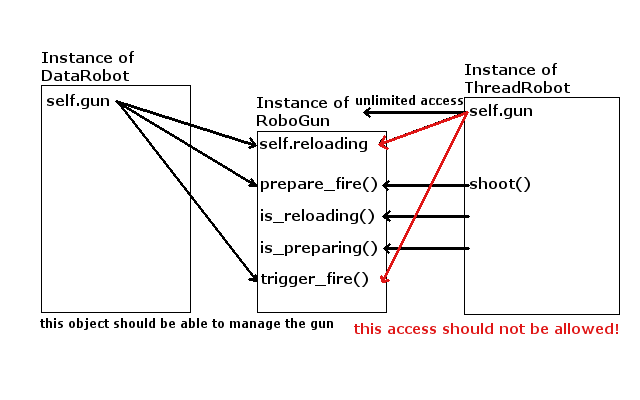
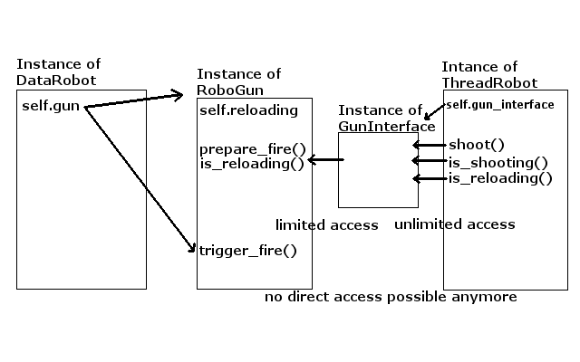

# Week 7: Give Guns to the Robots

### [<- Back](/index.md) to project overview.

### Now we stop playing around and get ready for some serious combat!

# Task: Each Robot should get a Gun
### The Robot should be able to issue fire commands from its movement functions.
### The Server should be able to read these commands and act properly.

## Problem: Initiate Actions from inside the thread
### Up until now, the thread only needed to provide information to be read be the server.<br/>Now the thread needs to start the communication!
### Since the server only performs shoot actions at each tick but the thread can initiate these actions any time, we need another way of thread safe communication!
```python
class Board(QWidget):
    def timerEvent(self, event):
        # [...]
        self.calculate_shoot_action()

class ThreadRobot(BaseRobot):
    def shoot(self):
        # ???
```

## Solution: Mediator Class RoboGun
### We add a new class `RoboGun` that can communicate with both the robot and the server:
```python
class RoboGun:
    BULLET_SPEED = 10

    def __init__(self, bullet_speed=None):

        self.bullet_speed = bullet_speed
        if not bullet_speed:
            self.bullet_speed = RoboGun.BULLET_SPEED
        self.reloading = False


    def is_preparing(self):
        # returns, wheather the robot will shoot in the next server tick

    def is_reloading(self):
        return self.reloading

    def prepare_fire(self, data=True):
        # call this to make the robot shoot in the next server tick

    def trigger_fire(self):
        # the server calls this at each tick to check if the robot is shooting
```
### For this, we give the same instance of `RoboGun` to both the `DataRobot` and the `ThreadRobot`
```python
class Board(QWidget):
    def construct_robot(self, radius, movement_funct, a_max, a_alpha_max,
                        position, fov_angle=90):

        # Create robot body with its set parameters.
        base_robot = BaseRobot(radius, a_max, a_alpha_max, fov_angle)

        # Create a new instance of the gun object.
        gun = RoboGun()

        # Give the ThreadRobot a reference to the mediator object.
        thread_robot = ThreadRobot(base_robot, movement_funct, gun)

        # Give the DataRobot a reference to the mediator object.
        data_robot = DataRobot(base_robot, thread_robot, gun)

        # [...]
```
### Use the interfacte functions defined above in the server:
```python
    def calculate_shoot_action(self):
        for robot in self.robots:

            robot.gun.trigger_fire()
            
            # [...]
```

## Now we can fill in the definitions:
### We use another event queue for threadsafe communication.
Every time, we call the `shoot()` command in the robot, we enqueue a new fire task. At each tick, the server will look for enqueued fire tasks an perform them adequately. If the queue is empty, the robot won't shoot!
```python
class RoboGun:
    BULLET_SPEED = 10
    FIRE_QUEUE_SIZE = 20

    def __init__(self, bullet_speed=None):

        self.bullet_speed = bullet_speed
        if not bullet_speed:
            self.bullet_speed = RoboGun.BULLET_SPEED
        self.reloading = False
        self.fire_queue = queue.Queue(RoboGun.FIRE_QUEUE_SIZE)

    # these are called by the robot
    def is_preparing(self):
        return not self.fire_queue.empty()

    def is_reloading(self):
        return self.reloading

    def prepare_fire(self, data=True):
        # More complex data might be used later.
        self.fire_queue.put(data, block=False)

    # this will be called by the server
    def trigger_fire(self):
        task = self._get_fire_task()
        if not task:
            # return false if no fire task is found
            return False

        # ???
        self._initiate_reload()

        # return some information if a fire task is found
        return self.bullet_speed

    def _get_fire_task(self):
        # if no item is in the queue, don't wait until it is!
        try:
            task = self.fire_queue.get(block=False)
        except queue.Empty:
            return False
        else:
            return True, task
```
### We give the queue a maximum size, that the robot can't endlessly spam `shoot()` commands overloading our memory.
### Another advantage of the queue structure: We might need to enqueue different types of fire commands later, for example an angle in which the robot will shoot.

## Task: Reloading
### The gun should not be able to fire for one second while reloading.
### We use the `reloading` Boolean to check, if the gun is reloading and cannot shoot:
```python
  def trigger_fire(self):

        # notify the server that the robot is still reloading.
        # no need to look at the fire queue.
        if self.reloading:
            return False

        task = self._get_fire_task()

        # [...]

        self._initiate_reload()
```
### To keep the booleans value up to date, we use the `_initiate_reload()` function:
```python
    def _initiate_reload(self):

        # set reloading to True
        self.reloading = True
        
        def finish_reload():
            self.reloading = False

        # call a function, that will set reloading to false after one second has passed
        Utils.execute_after(1, finish_reload)


    # execute_after will create a new thread
    # that will perform the given task after the given time
    def execute_after(secs: float, func):
        def wait_and_call(secs, func):
            time.sleep(secs)
            func()

        t = threading.Thread(target=wait_and_call, args=(secs, func))
        t.daemon = True
        t.start()
```

Now our gun should work as expected!

## Problem: Unlimited Access
### Since our robot hat access to the gun instance, it can menipulate any part of it, especially the `reloading` boolean.<br/>It could be able to skip reload time by itself gaining an unfair advantage!


## Solution: GunInterface
### We restrict the access of the ThreadRobot by constructing a special interface class that only allows access to certain functions and data.


### We make use of the fact that in python all functions are normal data.
```python
class GunInterface:
    def __init__(self, gun: RoboGun):

        self.is_preparing = gun.is_preparing
        self.is_reloading = gun.is_reloading
        self.prepare_fire = gun.prepare_fire
```
### Now the `ThreadRobot` can access only the functions it needs.
```python
class ThreadRobot(BaseRobot):
    
    def __init__(self, base_robot: BaseRobot, movement_funct):

        # use the gun_interface to tell the server when you want to shoot.
        self.gun_interface = None

        # [...]
    
    def setup_gun_interface(self, gun_interface):
        self.gun_interface = gun_interface

    def is_reloading(self):
        if self.gun_interface:
            return self.gun_interface.is_reloading()
        return False

    def is_shooting(self):
        if self.gun_interface:
            return self.gun_interface.is_preparing()
        return False

    def shoot(self):
        if self.gun_interface:
            self.gun_interface.prepare_fire()
```

### The `DataRobot` should be able to manage the setup.
```python
class DataRobot(BaseRobot):
    
    def __init__(self, base_robot: BaseRobot, thread_robot: ThreadRobot):

        self.gun = None

        self.thread_robot = thread_robot

        # [...]

    def setup_gun(self, gun=None):
        if not gun:
            # if no gun is given, create a default gun
            gun = RoboGun()

        # gain control over the gun instance
        self.gun = gun

        # only give the thread_robot the reduced interface
        gun_interface = GunInterface(gun)
        self.thread_robot.setup_gun_interface(gun_interface)
```
### Call this function in robot setup.
```python
    def construct_robot(self, radius, movement_funct, a_max, a_alpha_max,
                        position, fov_angle=90, gun=None):

        base_robot = BaseRobot(radius, a_max, a_alpha_max, fov_angle)
        thread_robot = ThreadRobot(base_robot, movement_funct)
        data_robot = DataRobot(base_robot, thread_robot)

        # set up communication with thread robot about gun data
        data_robot.setup_gun(gun)

        return data_robot
```

### Now our Robots can tell the Server when they want to shoot!

# Task: The Guns should shoot Bullets
### Once our gun is fired, it should create a bullet, that will keep moving across the battlefiled.
### For this, we need to keep track of its position, speed and direction:
```python
class Bullet:
    def __init__(self, position, speed, direction):
        self.position = position
        self.speed = speed
        self.direction = direction
```

## Subtask: How to keep track of the bullets?
### The server needs a way to store all bullets. This data structure should be fast and easily accessable whilst allowing quick removal of bullets that collided with terrain or hit robots.

### We use pythons implementation of sets:
```python
class Board(QWidget):

    def __init__(self, parent):

        self.bullets = set()

        # [...]
```
### We can now iterate over every bullet in a shallow copy while deleting bullets in the main set.
```python
class Board(QWidget):

    def calculate_bullets(self):
        for bullet in self.bullets.copy():
            # do_stuff(bullet)

            # if we want to delete the bullet
            self.bullets.remove(bullet)
```

## Subtask: Create a bullet:
### The server now needs a way to create new bullets depending on the issued fire commands of the robots.
### Since bullets are part of the server, but the fire commands are issued by the robot, we choose to leave the bullet generation to the `DataRobot`:
```python
class DataRobot(BaseRobot):

    # create bullet if fire command is issued
    def perform_shoot_action(self):

        maybe_bullet = False

        maybe_data = self.gun.trigger_fire()
        # if trigger_fire returns false, there is no bullet to create
        # if it returns some data, use this data to create a bullet
        if maybe_data:
            # set the three parameters of the bullet
            angle = self.alpha

            angle_vector = Utils.vector_from_angle(angle)
            robot_center = (self.x, self.y)
            # be careful not to start inside the robot!
            bullet_start = robot_center + (self.radius + 1) * angle_vector

            speed = self.v + maybe_data

            maybe_bullet = Bullet(position=bullet_start,
                                  speed=speed,
                                  direction=angle)
        return maybe_bullet
```
### Now we can implement the function that handles the fire events of all robots:
```python
class Board(QWidget):
    def calculate_shoot_action(self):
        for robot in self.robots:
            maybe_bullet = robot.perform_shoot_action()
            if maybe_bullet:
                # add the bullet to the set!
                self.bullets.add(maybe_bullet)
```

## Subtask: Draw the bullets:
### For this we just need to add the corresponding function to the `paintEvent`:
```python
    def drawBullets(self, qp):
        qp.setPen(Qt.red)
        qp.setBrush(Qt.red)
        for bullet in self.bullets:
            pos = QPoint(bullet.position[0], bullet.position[1])
            qp.drawEllipse(pos, 3, 3)
```

## Subtask: Move the bullets!
# TODO LEANDER (calculate-bullet)

## Problem: Sequencing
### Now, that we have a way to create bullets, move bullets and calculate collision, we need to ponder, in which order we want to perform these events in the main loop, since they cannot be done at once.
### This is a non-trivial manner since moving robots and bullets in different order might achieve different outcomes:
In any case we should not separate the generation of new bullets from their movement, since otherwise it would be possible for a robot to be hit by the bullet it just shot itself.

This leaves us overall with two options: Moving the robots first or moving the bullets first.

By moving the robots first, we are punished with immense accuracy loss of the robots. The only way to compensate that would be complex mathematical movement predictions in the robot's movement functions that are not needed otherwise.

Therefore, we opt for moving the bullets first, making the trade-off that robots can be caught by bullets at their old position.

## Solution: Sequencing
```python
    def timerEvent(self, event):

        # Create bullets
        self.calculate_shoot_action()

        # Move bullets
        self.calculate_bullets()

        # Get data from robots
        # & move robots
        for robot in self.robots:
            poll = robot.poll_action_data()
            self.calculate_robot(poll, robot)

        # calculate robot collision
        self.check_collision_robots()

        # Send data to the robots
        for robot in self.robots:
            v = self.create_vision_message(robot)
            robot.send_sensor_data(v)
            m = self.create_position_message(robot)
            robot.send_sensor_data(m)

        # update visuals
        self.update()
```

# Task: The Robots should utilize the Guns
## Problem: When to enqueue a shot?
## Implement a funtion to decide.
```python
def shoot_straight(robot, data):
    x, y, alpha, v, v_alpha = data
    if type(robot.destination) == tuple:
        coordinates = robot.destination[0]
        angle = calculate_angle_between_vectors(coordinates, x, y, v, alpha)
        ready = not (robot.is_shooting() or robot.is_reloading())
        if ready and 0.01 < angle <= 90:
            # set acceptable inaccuracy
            max_inaccuracy = robot.radius
            # calculate aim inaccuracy
            inaccuracy = calculate_inaccuracy((x, y), coordinates, alpha, v)
            # decide action
            if inaccuracy <= max_inaccuracy and angle <= 90:
                robot.shoot()
```
### If the robot is not reloading or already about to shoot the robot enqueues a shot if the target is straight ahead of the robot. 

## How to calculate the inaccuracy?
```python
def calculate_inaccuracy(position, coordinates, alpha, vel):
    # For angles < 90
    x = position[0]
    y = position[1]
    c_x = coordinates[0]
    c_y = coordinates[1]
    robot_radian = (alpha / 180 * math.pi)

    # get angle between aim direction and target, as radian
    angle = calculate_angle_between_vectors(coordinates, x, y, vel, alpha)
    angle = angle % 360
    target_radian = (angle / 180 * math.pi)

    # calculate distance between position and coordinates
    distance = math.sqrt((c_x-x)**2 + (c_y-y)**2)

    # calculate opposite's length of Triangle
    a = (math.sin(target_radian)*distance)
    b = (math.sin(robot_radian)*distance)
    opp_abs = math.sqrt(a**2 + b**2)

    # calculate inaccuracy
    inaccuracy = math.sin(target_radian) * opp_abs
    return inaccuracy
```
Using geometric maths we determine the minimal distance between the projectiles path and the targets center point.


# Additional Features
## Trigun-Functionality
### Since our implementation features maxmum extensibility, we want to show you an example of the possible options.
### For this, we create a new modifier for guns, that lets them go wild!
Instead of only one trigger, the gun should be triggered three times with the same data over the course of the next server ticks.
```python
    @staticmethod
    def trigun_decorator(gun):

        # we need a new variable of the gun
        gun.trigun_count = 0

        # define a new fire function
        def trigger_fire_trigun(self):
            if self.reloading:
                # instead of blocking completely, we return the gunfire echo
                if self.trigun_count:
                    self.trigun_count += -1
                    return self.bullet_speed
                else:
                    return False

            task = self._get_fire_task()
            if not task:
                return False
            # get data by: _, task_data = task now.

            self._initiate_reload()

            self.trigun_count = 2

            return self.bullet_speed

        # override the old fire function
        gun.trigger_fire = types.MethodType(trigger_fire_trigun, gun)

        return gun
```
### Now we can use this decorator in the scenario setup.
```python
class Board(QWidget):

    def create_scenario(self):
        """Here, you can implement the scenario on the board.
        """

        pos = (45, 45, 0, 0, 0)
        mv = GunnerMovement()
        # pump this gun to maxxxx!
        gun = RoboGun()
        RoboGun.trigun_decorator(gun)
        robo = self.construct_robot(TILE_SIZE * 3, mv, 15, 10, pos, gun=gun)
        self.deploy_robot(robo)
```


# Givin' guns to robots? What do ya mean, this sounds like a bad idea?
